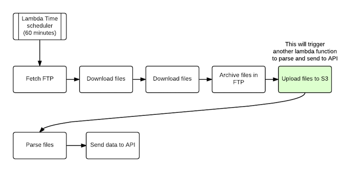
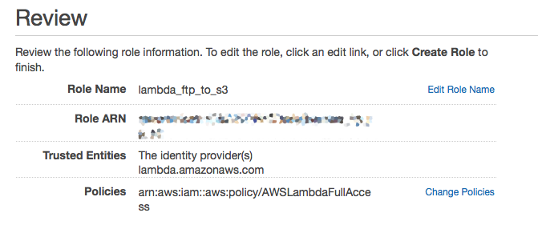

#AWS Lambda FTP Function

The following How-To will demonstrate how to use AWS Lambda service to:

- Connect to FTP
- Download files
- Archive files in FTP (moving them to `archive` folder)
- Save files to S3

Later this will trigger another event on Lambda to parse these files and send data to API Gateway.
**Make sure that S3 and Lambda are on the same region, otherwise Lambda event will not work.**

Flow diagram:

**This how-to assume that you have an AWS account with admin access.**

### Step 1
**Create S3 bucket.**

### Step 2
**Create Role to access this S3 bucket**

1. Click on Identity & Access Management (IAM)
2. Click on Roles
3. Create New Role
4. Name it `lambda_ftp_to_s3`
5. Select AWS Lambda.
6. Select `AWSLambdaFullAccess` and click Next.
7. This will then show you a review screen like below.

### Step 3
Create Lambda function

1. Click on Get started now.
2. Skip the next screen as it just showing pre-defined functions
3. In configure function, please fill the form as below

4. In the code section, copy and paste the code in [aws_lambda_ftp_function.py](./aws_lambda_ftp_function.py)
5. **Please make sure to populate data with your own specific credentials for S3 bucket name and FTP connection.
6. Handler, keep it as it is
7. Role, use the one that we have created on step 2.
8. Timeout is quite improtant in this application as you may expect delays, slow FTP connection or large number of files to download. I would put it as 1 minute.
9. Click create function

### Step 4
Now we need to setup the event to call this function to fetch FTP and download files.

1. In Lambda function page, go to `Event sources`
2. Add event source
3. Choose `CloudWatch Events - Schedule`
4. Use Rule name as you prefer and choose `Schedule expression`
5. You can either use pre-defined rates (1 minute, 5 minutes, 15 minutes, 1 hour or cron type schedule)

### Testing
To test your function, run **Test** from function page and you should be able to see output at buttom.

If everything was ok, you should be able to see files in your S3.

### TODO
- ~~Add code to archive files in FTP~~
- Add code to read files from S3, parse them and send them to API gateway
